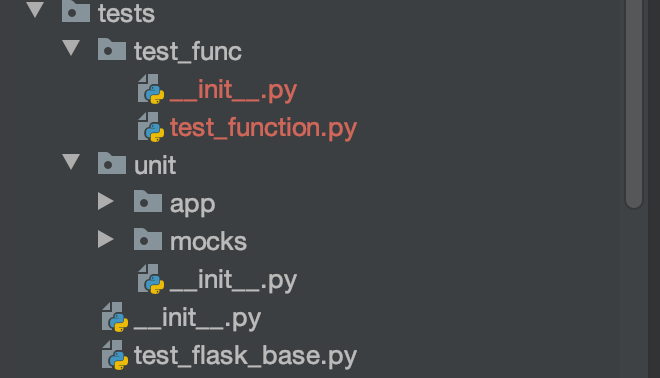
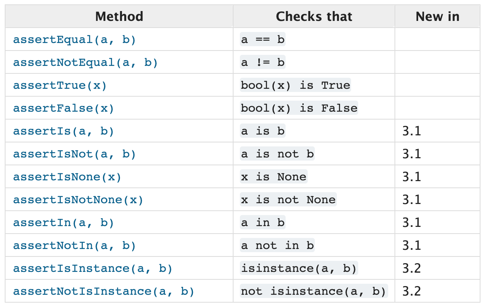
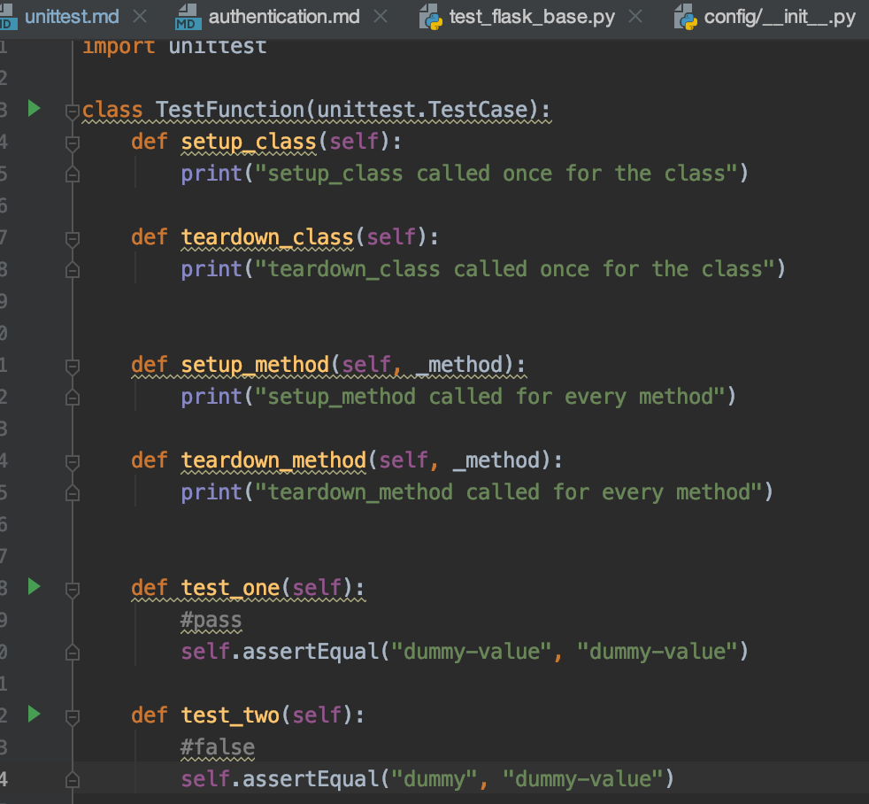
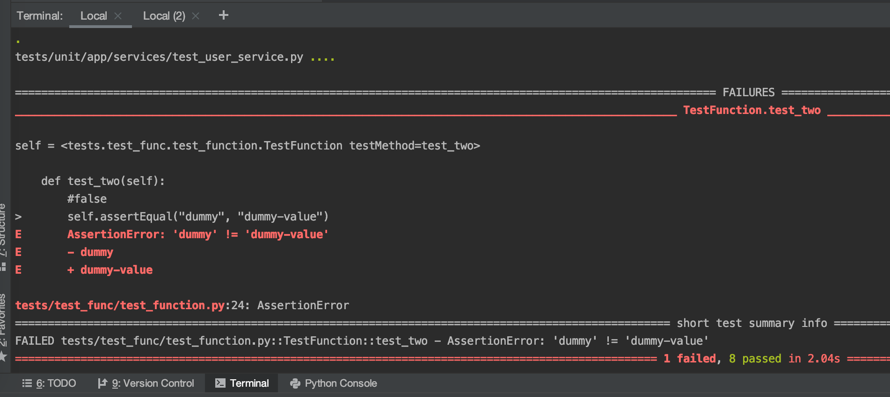

# How to run unittest

`docker-compose exec app  poetry run python manage.py test`

`poetry run python manage.py test`

## About unittest
In this project, we using 
[Pytest](https://docs.pytest.org/en/latest/index.html)

## Conventions for Python test discovery
You can find service unittest under 
`app-dir/tests/unit/app/services/`



In those directories, search for `test_*.py or *_test.py` files

## Faker data

Faker is a Python package that generates fake data for you. 
Whether you need to bootstrap your database, create good-looking XML documents,
fill-in your persistence to stress test it, or anonymize data taken from a production service, Faker is for you.

Use:

`pip install Faker`

```python
from faker import Faker
fake = Faker()

fake.name()
# 'Lucy Cechtelar'
```

## 1. Service unittest


```python
class TestStorageService:
    def setup_method(self, _method):
        pass

    def teardown_method(self, _method):
        pass

    def test_upload(self):
        service = self._get_service()

        path = os.getcwd()
        fileTmp = open(path+"/tests/unit/mocks/test_data/image.jpg", "rb")

        file = FileStorage(fileTmp)
        fileObject = service.upload(file)
        assert fileObject.url is not None


    @staticmethod
    def _get_service():
        return StorageService(MockStorageRepository(None), Local(), S3())
```

## What are the `setup` and `teardown` method?

the `setup` method is called prior to each unit test executing and 
the `teardown` method is called after each unit test finishes executing

You can use setup and teardown in the complex test case

## The TestCase class provides a number of methods to check for and report failures, such as:
To use it 
```python
import unittest

class TestFunction(unittest.TestCase):
    #code here
```



Example:





### If service required repository, you should create Mock repository
The mock repository should be under

`app-dir/tests/unit/mocks/repositories/`